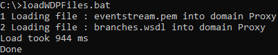
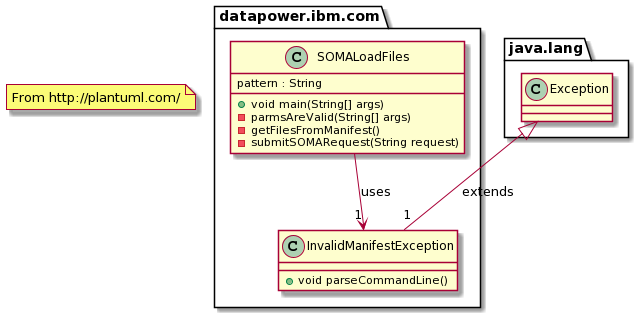

# DataPower files uploader in Java
Tool to load many files at once in any IBM DataPower Gateway domains written in Java.

## Table of content
1. [Use cases](#use-cases)
1. [Language](#language)
1. [Usage](#usage)
1. [XML Input file format](#xml-input-file-format)
1. [Invoking the tool](#invoking-the-tool)
1. [Installation](#installation)
1. [Design](#design)
1. [Overview](#overview)
1. [Class diagram](#class-diagram)
1. [Structure of the project](#structure-of-the-project)


## Use cases:
* Load many files from a workstation folder into any domains
* Load one or many files at development time, allowing developer to use his/her favorite IDE and then load repeatedly file(s) in one command.

## Language: Java
Application written in Java using the SOMA interface of DataPower.
SOMA is the XML Management interface to interact with IBM DataPower Gateways. It usually runs on port 5550 by default.
For more information on SOMA look the knowledge center [here](https://www.ibm.com/support/knowledgecenter/SS9H2Y_10.0/com.ibm.dp.doc/networkaccess_xmi.html) 

# Usage
This is a Java application (contains a main() method) which was written for several versions of JRE, the latest version being tested is Open JDK 11.
You need first to create an XML file containing the definition of files you want to upload into DataPower.
And then invoke the Java application using the script or directly using java exe.

## XML Input file format
This is a very simple XML file, each line contains 3 information.

| Field       | Type          | Description                                    | Example                |
|-------------|---------------|------------------------------------------------|------------------------|
| domain      | XML Attribute | The name on the DataPower domain               | domain="domain1"       |
| destination | XML Attribute | The name of the folder in the DataPower domain | destination="cert:///" |
| value       | Value (CDATA) | The full path of the file to be uploaded       | C:\TEST\Cert1.pem      |

One entry sample: 
```
<dpfile domain="domain1" destination="cert:///">C:\TEST\Cert1.pem</dpfile>
```

The full file is like this (In my case it's running on Windows): 
```
<?xml version="1.0" encoding="UTF-8"?>
<dpfiles xmlns="http://com.ibm.datapower/dpfiles">
	<dpfile domain="domain1" destination="cert:///">C:\TEST\Certificate1.pem</dpfile>
	<dpfile domain="domain2" destination="local:///dir1/dir2">C:\TEST\WSDLS\AccountCreation.wsdl</dpfile>
</dpfiles>
```

**Hint:** On windows using `dir /S /B <pattern>` gives you the absolute file paths (bare) recursively. This is useful to create quickly an XML input file for example with NotePad++ which allows text block manipulations.

## Invoking the tool
Before invoking the tool, you need to install it, see the design chapter.

* You can use the script provided after editing it to suit your environment: [Script for Windows](./scripts/loadWDPFiles.bat)
* You can use the following command `java -cp <classpath> datapower.ibm.com.SOMALoadFiles -action load -host <> -FILE <XML input file> -userId <user id> -userPwd <password>`
* For Maven specialists: Since the project has been written in Java with Maven, there is a test goal that can be used, you need to edit the arguments to suit your environment.

**hint:** Personally, I have added the loadWDPFiles.bat script file in C:\bin where I have all my binaries, and this folder is in my PATH. Like this, it is very easy to use. I do change the bat file to point to the right input file when I need. You could use a parameter (or has many parameters of course for additional security for example and not have the password hard-coded...).

# Installation 
1. git clone the repository
2. Compile code using maven
3. get the dependencies for example using the maven command: `mvn dependency:copy-dependencies` and place them where convenient
4. Update the loadWDPFiles.bat script (or create the equivalent in Linux)
5. Use it with an IBM DataPower Gateway

Here is a sample output:



# Design
## Overview
The tool has been written in Java in Eclipse. It uses Maven for compilation and test.

The code written is very small. It heavily relies on JAX-B and XJC so I can generate most of the code automatically and follow updates on that side very easily. The use of JAX-B allows me two things: the generation of the request according to the SOMA interface, and the input file format. If the SOMA interface changes I can simply update the schema file (xml-mgmt-ops.xsd). The input file format is my own and should not change, but if you want to extend it, simply change the schema and add the new code to handle the extension. Notice, that the xml-mgmt-ops.xsd is not the original schema provided by DataPower but a trimmed version, this is done to generate only the operation I need (upload file).
The two schemas are located under the schema folder.

My development environment is as follow: 
Apache Maven 3.5.3
Maven home: C:\eclipse\workspaces\APIC\SetFile\EMBEDDED
Java version: 11, vendor: Oracle Corporation
Java home: C:\Program Files\Java\jdk-11
OS name: "windows 10", version: "10.0", arch: "amd64", family: "windows"

## Class diagram


## Structure of the project

| File or folder                                      | Description                                           |
|-----------------------------------------------------|-------------------------------------------------------|
| src\datapower\ibm\com\InvalidManifestException.java | Source code: Exception class                          |
| src\datapower\ibm\com\SOMALoadFiles.java            | Source code: Main class                               |
| schemas\files.xsd                                   | Input file format schema definition (XSD)             |
| schemas\xml-mgmt-ops.xsd                            | SOMA interface schema definition (XSD)                |
| pom.xml                                             | Maven Project object model definition                 |
| scripts\loadWDPFiles.bat                            | Script for Windows to use the tool                    |
| xmls\files.xml                                      | Sample input file                                     |
| target\generated\src                                | Folder containing the code generated with xjc command |
| doc                                                 | Documentation for this project                        |